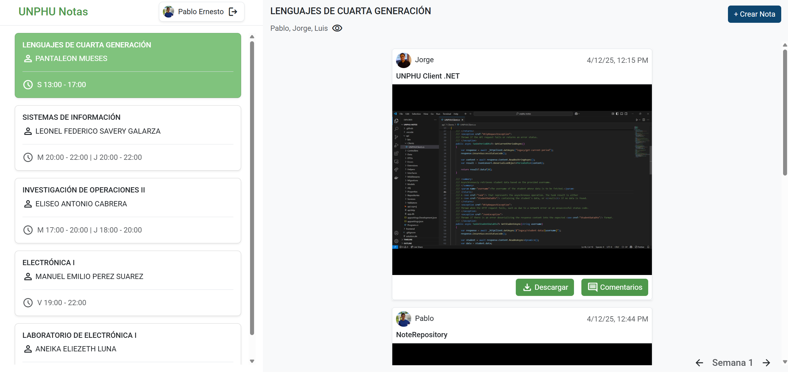
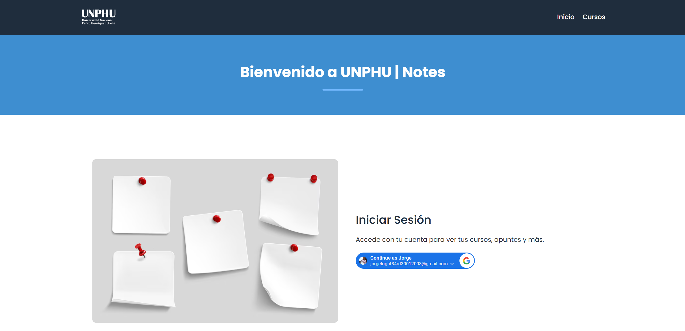
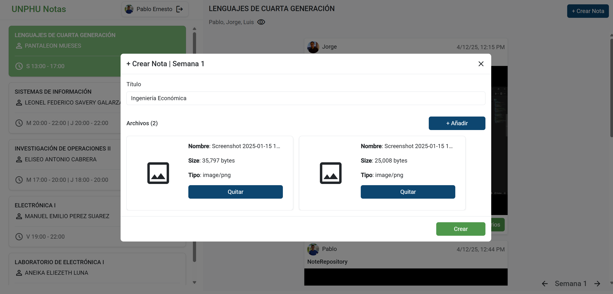
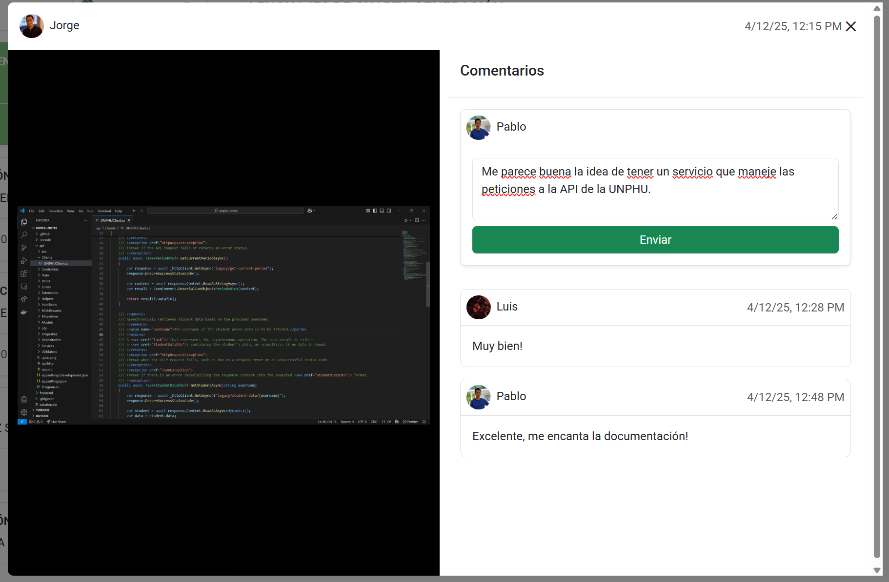
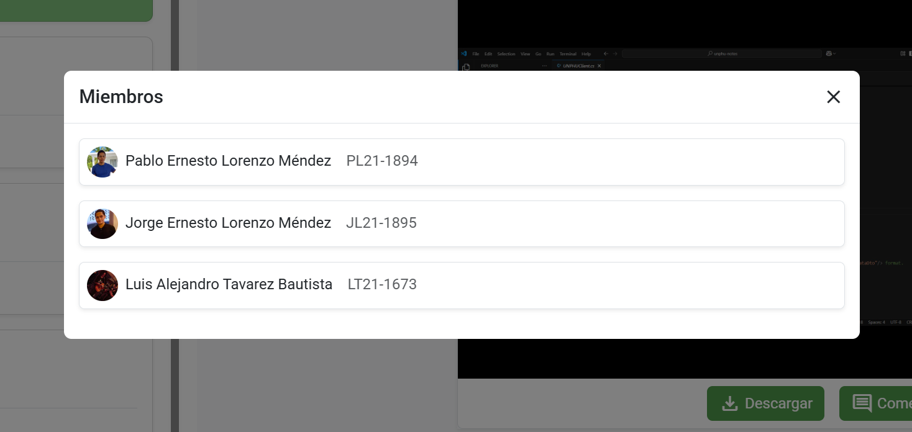

# UNPHU Notes



## Plataforma Colaborativa para Compartir Recursos Académicos

UNPHU Notes es una aplicación web diseñada para facilitar la colaboración y el intercambio de recursos académicos entre estudiantes de la Universidad Nacional Pedro Henríquez Ureña (UNPHU). A través de una interfaz intuitiva y organizada, los usuarios pueden acceder a apuntes de clase, compartir materiales y participar en un ecosistema de aprendizaje colaborativo.

## Características Principales

- **Acceso a recursos académicos**: Consultar apuntes de clase, guías de estudio y materiales complementarios organizados por disciplina, curso y semestre.

- **Compartir materiales**: Contribuir con recursos académicos propios para beneficio de la comunidad estudiantil.

- **Organización jerárquica**: Navegación sencilla a través de una estructura organizada por disciplinas académicas, cursos y semestres.

- **Colaboración comunitaria**: Participación en un ecosistema de aprendizaje colaborativo que mejora la experiencia educativa.

## Capturas de Pantalla

### Inicio de Sesión


### Creación de Notas


### Sistema de Comentarios


### Vista de Miembros


## Estructura del Proyecto

El proyecto está dividido en dos componentes principales:

### Backend (ASP.NET Core)
- APIs RESTful para la gestión de usuarios, grupos, notas y comentarios
- Autenticación y autorización
- Integración con servicios externos (Cloudinary para almacenamiento de archivos)
- Conexión a API de UNPHU para datos académicos

### Frontend (Angular)
- Interfaz de usuario responsive
- Componentes modulares para grupos, notas y comentarios
- Servicios para comunicación con el backend
- Directivas para manejo de archivos y descarga de notas

## Tecnologías Utilizadas

### Backend
- ASP.NET Core 9.0
- Entity Framework Core
- Identity Framework
- SQL Server (Base de datos)
- Cloudinary (Almacenamiento de archivos)

### Frontend
- Angular 17
- TypeScript
- CSS3/HTML5
- Servicios de terceros para autenticación (Google)

## Instalación y Configuración

### Requisitos Previos
- .NET 9.0 SDK o superior
- Node.js 18 o superior
- Angular CLI
- SQL Server o SQL Express

### Backend
1. Navega al directorio `api`
2. Ejecuta `dotnet restore` para restaurar las dependencias
3. Configura la cadena de conexión en `appsettings.json`
4. Aplica las migraciones con `dotnet ef database update`
5. Inicia el servicio con `dotnet run`

### Frontend
1. Navega al directorio `frontend`
2. Ejecuta `npm install` para instalar las dependencias
3. Configura las variables de entorno en `environments/environment.ts`
4. Inicia el servidor de desarrollo con `ng serve`

## Uso

1. Accede a la aplicación con credenciales institucionales de UNPHU
2. Explora los grupos de asignaturas disponibles
3. Consulta notas existentes o crea nuevas
4. Adjunta archivos a tus notas para compartir documentos, imágenes, etc.
5. Participa en discusiones mediante el sistema de comentarios

## Estructura de Directorios

```
├── api                      # Backend ASP.NET Core
│   ├── Controllers          # Controladores API
│   ├── Models               # Entidades y modelos
│   ├── Services             # Servicios de aplicación
│   └── ...
├── frontend                 # Frontend Angular
│   ├── src
│   │   ├── app
│   │   │   ├── components   # Componentes reutilizables
│   │   │   ├── pages        # Páginas principales
│   │   │   ├── services     # Servicios de comunicación
│   │   │   └── ...
│   └── ...
└── assets                   # Recursos y capturas de pantalla
```

## Contribución

Si deseas contribuir al proyecto, sigue estos pasos:

1. Haz fork del repositorio
2. Crea una nueva rama (`git checkout -b feature/nueva-caracteristica`)
3. Realiza tus cambios
4. Haz commit de tus cambios (`git commit -m 'Añade nueva característica'`)
5. Haz push a la rama (`git push origin feature/nueva-caracteristica`)
6. Abre un Pull Request

## Licencia

Este proyecto está licenciado bajo la Licencia MIT - ver el archivo [LICENSE](LICENSE) para más detalles.

## Equipo de Desarrollo

- Jorge Lorenzo 21-1895
- Pablo Lorenzo 21-1894
- Luis Tavarez 21-1673

## Agradecimientos

- Universidad Nacional Pedro Henríquez Ureña (UNPHU)
- Pantaleón Mueses Martínez (Facilitador)
- Escuela de Informática
